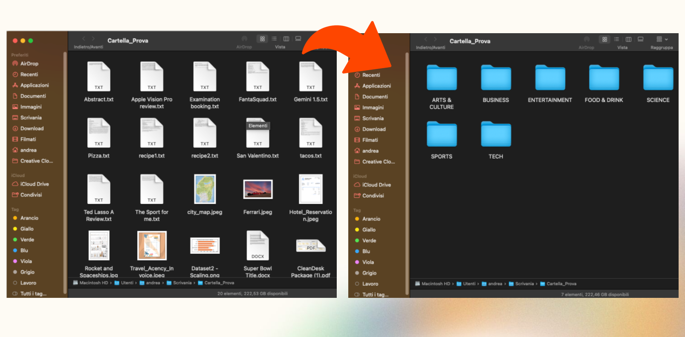

# CleanDesk

CleanDesk è un applicazione desktop, per Windows e MacOS,  che sfrutta l'intelligenza artificiale per **trasformare qualsiasi cartella sul tuo computer in un ambiente di lavoro efficiente e intuitivo**.

## L'obiettivo
Il software CleanDesk è stato progettato per migliorare l’esperienza informatica e massimizzare la produttività dei propri utenti.
A questo scopo saranno forniti strumenti avanzati, che sfruttano l’intelligenza artificiale per organizzare e trovare rapidamente i documenti, immagini e progetti all’interno di un ambiente digitale come il Desktop.

CleanDesk vuole semplificare la vita digitale di qualsiasi suo utente: dal professionista, all’appassionato di tecnologia fino ad arrivare agli utilizzatori casuali e poco pratici in mate- ria; a tutti sarà fornito un ambiente digitale privo di caos ed ordinato in maniera intuitiva. Inoltre ognuno potrà gestire questo spazio in maniera consapevole tramite un efficiente gestione ed analisi della memoria fornita da CleanDesk.

## Come funziona
Questo software è in grado di leggere ed **analizzare tutti i file** all'interno di una cartella e classificare ognuno di questi, **assegnandogli una categoria in base alla sua tipologia** e soprattutto argomento. Sulla base di questa classificazione, **la cartella sarà originale completamente riorganizzata**, creando nuove sottocartelle per categoria, e spostando i relativi file.

## Le funzionalità
CleanDesk sfrutta innanzitutto un modulo di intelligenza artificiale con task di classificazione che riesce ad estrapolare il significato e l’ambito di utilizzo di ogni file al fine di assegnarlo automaticamente ad una delle seguenti categorie:
| Categoria                | Descrizione                               |
|--------------------------|-------------------------------------------|
| Politics                 | Notizie e discussioni politiche           |
| Sports                   | Eventi e notizie sportive                 |
| Business                 | Finanza, economia e notizie aziendali     |
| Parenting                | Consigli e risorse per i genitori         |
| Tech                     | Tecnologia e innovazione                  |
| Arts & Culture           | Arte, musica, letteratura e cultura       |
| Science & Mathematics    | Scienza, ricerca e matematica             |
| Style & Beauty           | Moda, bellezza e stile                    |
| Travel                   | Viaggi, destinazioni e consigli di viaggio|
| Food & Drink             | Ricette, cibo e bevande                   |
| Entertainment            | Film, musica, giochi e spettacoli         |
| Home & Living            | Casa, giardinaggio e vita quotidiana      |
| Education                | Risorse e notizie educative               |
| Others                   | Altri argomenti                           |

L’utente può **personalizzare accuratamente questa classificazione**, per adattarla ancora alle sue preferenze, specificando una serie di **filtri e regole specifiche** che il sistema seguirà durante l’organizzazione. In particolare l’Utente può:

- scegliere se il contenuto dei file deve essere considerato per la classificazione.
- creare una "blacklist" in cui inserire i singoli file, intere cartelle oppure estensioni di file da non considerare nella classificazione e da lasciare nella loro posizione originale.

- scegliere se creare delle sotto-cartelle, per ogni categoria, in cui inserire i file multimediali divisi per tipologia.
- scegliere se effettuare sempre una classificazione oppure inserire nella cartella "Others" i file con classificazione incerta.
- scegliere se preservare le sotto-cartelle, oppure ammettere nell’organizzazione i file che queste contengono.

In questo modo ogni utente può ottenere un organizzazione cucita su misura e adatta alle proprie abitudini, grazie alla quale riuscirà sicuramente a migliorare la propria produttività e facilità di accesso ai propri file.

## Manuali

È possibile consultare i manuali del software ai seguenti link:

- [**Manuale Utente**](https://drive.google.com/file/d/1l-A5LJHwvrAj5ZwfZZjI9zQuWlBdZk4Z/view?usp=sharing)

- [**Manuale di Installazione**](https://drive.google.com/file/d/10qyWaBdD1jExLzHUwozHbl9ZlnpfLcn6/view?usp=sharing)

# Implementazione
## I Dataset
Per il training del modello di machine learning alla base di questo progetto, **sono stati utilizzati dei dataset di "News Category"**, ovvero insieme di articoli e notizie di testate giornalistiche online. Questa è risultata essere una scelta efficace poichè sono stati utilizzati dei testi di alta qualità e già classificati correttamente tramite la loro categoria.

In particolare, **sono stati utilizzati i seguenti dataset:**

1. (Dataset 1) News Category [(link)](https://www.kaggle.com/datasets/rmisra/news-category-dataset)

   Questo dataset contiene circa 210k titoli di notizie raccolte dal 2012 al 2022 su HuffPost2.

2. (Dataset 2) BBC News [(link)](https://www.kaggle.com/code/venkatkrishnan/bbc-news-text-classification)

   Dataset molto simile al primo con 2126 osservazioni di articoli pubblicati dalla testata BCC3.

## Tech Stack

**Front-end:** HTML, CSS, JavaScript

**Back-end:** Electron.js, Python

# Downloads

**Una volta installati tutti i pre-requisiti [(Consulta il manuale)](#manuali)**, tutto è pronto per ottenere CleanDesk sul proprio com- puter. La nostra **applicazione non richiede installazione** poichè viene distribuita in un **pacchetto "buildato" e pronto all’esecuzione.**

È quindi possibile **scaricare direttamente l’intera applicazione** e avviarla subito tramite l’apposito **file eseguibile**.

- **[Download per windows](http://tiny.cc/cleandesk-windows)**

- **[Download per MacOS](http://tiny.cc/cleandesk-macos)**

